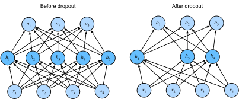

# Dropout
:label:`sec_dropout`

Just now, in :numref:`sec_weight_decay`,
we introduced the classical approach
to regularizing statistical models 
by penalizing the $\ell_2$ norm of the weights.
In probabilistic terms, we could justify this technique
by arguing that we have assumed a prior belief
that weights take values from 
a Gaussian distribution with mean $0$.
More intuitively, we might argue
that we encouraged the model to spread out its weights
among many features and rather than depending too much
on a small number of potentially spurious associations.

## Overfitting Revisited

Faced with more features than examples, 
linear models tend to overfit.
But given more examples than features,
we can generally count on linear models not to overfit.
Unfortunately, the reliability with which
linear models generalize comes at a cost:
Naively applied, linear models do not take 
into account interactions among features.
For every feature, a linear model must assign
either a positive or a negative weight, ignoring context.

In traditional texts, this fundamental tension 
between generalizability and flexibility
is described as the *bias-variance tradeoff*.
Linear models have high bias
(they can only represent a small class of functions),
but low variance (they give similar results
across different random samples of the data).

Deep neural networks inhabit the opposite 
end of the bias-variance spectrum.
Unlike linear models, neural networks,
are not confined to looking at each feature individually.
They can learn interactions among groups of features.
For example, they might infer that 
“Nigeria” and “Western Union” appearing 
together in an email indicates spam
but that separately they do not.

Even when we have far more examples than features,
deep neural networks are capable of overfitting.
In 2017, a group of researchers demonstrated
the extreme flexibility of neural networks
by training deep nets on randomly-labeled images.
Despite the absence of any true pattern
linking the inputs to the outputs,
they found that the neural network optimized by SGD,
could label every image in the training set perfectly.

Consider what this means.
If the labels are assigned uniformly
at random and there are 10 classes,
then no classifier can do better 
than 10% accuracy on holdout data.
The generalization gap here is a whopping 90%.
If our models so expressive that they 
can overfit this badly, then when should
we expect them not to overfit?
The mathemtatical foundations for 
the puzzling generalization properties
of deep networks remain open research questions,
and we encourage the theoretically-oriented 
reader to dig deeper into the topic.
For now, we turn to the more terrestrial investigation of 
practical tools that tend (empirically)
to improve the generalization of deep nets.


## Robustness through Perturbations

Let's think briefly about what we 
expect from a good predictive model.
We want it to peform well on unseen data.
Classical generalization theory
suggests that to close the gap between
train and test performance, 
we should aim for a *simple* model.
Simplicity can come in the form
of a small number of dimensions,
as we explored when discussing 
linear models monomial basis functions
:numref:`sec_model_selection`.
As we saw when discussing weight decay 
($\ell_2$ regularization) :numref:`sec_weight_decay`,
the (inverse) norm of the parameters 
represents another useful measure of simplicity.
Another useful notion of simplicity is smoothness,
i.e., that the function should not be sensitive
to small changed to its inputs.
For instance, when we classify images,
we would expect that adding some random noise
to the pixels should be mostly harmless.

In 1995, Christopher Bishop formalized
this idea when he proved that training with input noise 
is equivalent to Tikhonov regularization :cite:`Bishop.1995`.
This work drew a clear mathematical connection
between the requirement that a function be smooth (and thus simple),
and the requirement that it be resilient 
to perturbations in the input.

Then, in 2014, Srivastava et al. :cite:`Srivastava.Hinton.Krizhevsky.ea.2014`
developed a clever idea for how to apply Bishop's idea
to the *internal* layers of the network, too.
Namely, they proposed to inject noise 
into each layer of the network
before calculating the subsequent layer during training.
They realized that when training 
a deep network with many layers,
enforcing smoothness just on the input-output mapping.

Their idea, called *dropout*, involves 
injecting noise while computing 
each internal layer during forward propagation,
and it has become a standard technique
for training neural networks.
The method is called *dropout* because we literally
*drop out* some neurons during training.
Throughout training, on each iteration,
standard dropout consists of zeroing out 
some fraction (typically 50%) of the nodes in each layer
before calculating the subsequent layer.

To be clear, we are imposing 
our own narrative with the link to Bishop.
The original paper on dropout
offers intuition through a surprising 
analogy to sexual reproduction.
The authors argue that neural network overfitting
is characterized by a state in which 
each layer an relies on a specifc 
pattern of activations in the previous layer,
calling this condition *co-adaptation*.
Dropout, they claim, breaks up co-adaptation
just as sexual reproduction is argued to 
break up co-adapted genes. 

The key challenge then is *how* to inject this noise.
One idea is too inject the noise in an *unbiased* manner
so that the expected value of each layer---fixing 
the others equal to the value it would have taken absent noise.

In Bishop's work, he added Gaussian noise 
to the inputs to a linear model:
At each training iteration, he added noise
sampled from a distribution with mean zero
$\epsilon \sim \mathcal{N}(0,\sigma^2)$ to the input $\mathbf{x}$,
yielding a perturbed point $\mathbf{x}' = \mathbf{x} + \epsilon$.
In expectation, $E[\mathbf{x}'] = \mathbf{x}$.

In standard dropout regularization,
one debiases each layer by normalizing 
by the fraction of nodes that were retained (not dropped out).
In other words, dropout with *dropout probability* $p$ 
is applied as follows:

$$
\begin{aligned}
h' =
\begin{cases}
    0 & \text{ with probability } p \\
    \frac{h}{1-p} & \text{ otherwise}
\end{cases}
\end{aligned}
$$

By design, the expectation remains unchanged, i.e., $E[h'] = h$.
Intermediate activations $h$ are replaced by
a random variable $h'$ with matching expectation.


## Dropout in Practice

Recall the multilayer perceptron (:numref:`sec_mlp`) 
with a hidden layer and 5 hidden units. 
Its architecture is given by

$$
\begin{aligned}
    \mathbf{h} & = \sigma(\mathbf{W}_1 \mathbf{x} + \mathbf{b}_1), \\
    \mathbf{o} & = \mathbf{W}_2 \mathbf{h} + \mathbf{b}_2, \\
    \hat{\mathbf{y}} & = \mathrm{softmax}(\mathbf{o}).
\end{aligned}
$$

When we apply dropout to a hidden layer,
zeroing out each hidden unit with probability $p$,
the result can be viewed as a network 
containing only a subset of the original neurons.
In :numref:`fig_dropout2`, $h_2$ and $h_5$ are removed.
Consequently, the calculation of $y$ 
no longer depends on $h_2$ and $h_5$
and their respective gradient also vanishes 
when performing backprop.
In this way, the calculation of the output layer
cannot be overly dependent on any 
one element of $h_1, \ldots, h_5$.


:label:`fig_dropout2`

Typically, ***we disable dropout at test time***.
Given a trained model and a new example,
we do not drop out any nodes 
(and thus do not need to normalize).
However, there are some exceptions:
some researchers use dropout at test time as a heuristic 
for estimating the *uncertainty* of neural network predictions:
if the predictions agree across many different dropout masks,
then we might say that the network is more confident.
For now we will put off uncertainty estimation 
for subsequent chapters and volumes.


## Implementation from Scratch

To implement the dropout function for a single layer,
we must draw as many samples 
from a Bernoulli (binary) random variable
as our layer has dimensions, 
where the random variable takes value $1$ (keep) 
with probability $1-p$ and $0$ (drop) with probability $p$.
One easy way to implement this is to first draw samples
from the uniform distribution $U[0, 1]$.
Then we can keep those nodes for which the corresponding
sample is greater than $p$, dropping the rest.

In the following code, we implement a `dropout_layer` function
that drops out the elements in the `ndarray` input `X`
with probability `dropout`,
rescaling the remainder as described above
(dividing the survivors by `1.0-dropout`).

```{.python .input  n=1}
import d2l
from mxnet import autograd, gluon, init, np, npx
from mxnet.gluon import nn
npx.set_np()

def dropout_layer(X, dropout):
    assert 0 <= dropout <= 1
    # In this case, all elements are dropped out
    if dropout == 1:
        return np.zeros_like(X)
    mask = np.random.uniform(0, 1, X.shape) > dropout
    return mask.astype(np.float32) * X / (1.0-dropout)
```

We can test out the `dropout_layer` function on a few examples.
In the following lines of code, 
we pass our input `X` through the dropout operation,
with probabilities 0, 0.5, and 1, respectively.

```{.python .input  n=2}
X = np.arange(16).reshape(2, 8)
print(dropout_layer(X, 0))
print(dropout_layer(X, 0.5))
print(dropout_layer(X, 1))
```

```{.json .output n=2}
[
 {
  "name": "stdout",
  "output_type": "stream",
  "text": "[[ 0.  1.  2.  3.  4.  5.  6.  7.]\n [ 8.  9. 10. 11. 12. 13. 14. 15.]]\n[[ 0.  0.  0.  0.  8. 10. 12.  0.]\n [16.  0. 20. 22.  0.  0.  0. 30.]]\n[[0. 0. 0. 0. 0. 0. 0. 0.]\n [0. 0. 0. 0. 0. 0. 0. 0.]]\n"
 }
]
```

### Defining Model Parameters

Again, we work with the Fashion-MNIST dataset
introduced in :numref:`sec_softmax_scratch`.
We define a multilayer perceptron with 
two hidden layers containing 256 outputs each.

```{.python .input  n=3}
num_inputs, num_outputs, num_hiddens1, num_hiddens2 = 784, 10, 256, 256

W1 = np.random.normal(scale=0.01, size=(num_inputs, num_hiddens1))
b1 = np.zeros(num_hiddens1)
W2 = np.random.normal(scale=0.01, size=(num_hiddens1, num_hiddens2))
b2 = np.zeros(num_hiddens2)
W3 = np.random.normal(scale=0.01, size=(num_hiddens2, num_outputs))
b3 = np.zeros(num_outputs)

params = [W1, b1, W2, b2, W3, b3]
for param in params:
    param.attach_grad()
```

### Defining the Model

The model below applies dropout to the output 
of each hidden layer (following the activation function).
We can set dropout probabilities for each layer separately.
A common trend is to set
a lower dropout probability closer to the input layer.
Below we set it to 0.2 and 0.5 for the first 
and second hidden layer respectively.
 By using the `is_training` function described in :numref:`sec_autograd`,
 we can ensure that dropout is only active during training.

```{.python .input  n=4}
dropout1, dropout2 = 0.2, 0.5

def net(X):
    X = X.reshape(-1, num_inputs)
    H1 = npx.relu(np.dot(X, W1) + b1)
    # Use dropout only when training the model
    if autograd.is_training():
        # Add a dropout layer after the first fully connected layer
        H1 = dropout_layer(H1, dropout1)
    H2 = npx.relu(np.dot(H1, W2) + b2)
    if autograd.is_training():
        # Add a dropout layer after the second fully connected layer
        H2 = dropout_layer(H2, dropout2)
    return np.dot(H2, W3) + b3
```

### Training and Testing

This is similar to the training and testing of multilayer perceptrons described previously.

```{.python .input  n=5}
num_epochs, lr, batch_size = 10, 0.5, 256
loss = gluon.loss.SoftmaxCrossEntropyLoss()
train_iter, test_iter = d2l.load_data_fashion_mnist(batch_size)
d2l.train_ch3(net, train_iter, test_iter, loss, num_epochs,
              lambda batch_size: d2l.sgd(params, lr, batch_size))
```

```{.json .output n=5}
[
 {
  "data": {
   "image/svg+xml": "<?xml version=\"1.0\" encoding=\"utf-8\" standalone=\"no\"?>\n<!DOCTYPE svg PUBLIC \"-//W3C//DTD SVG 1.1//EN\"\n  \"http://www.w3.org/Graphics/SVG/1.1/DTD/svg11.dtd\">\n<!-- Created with matplotlib (https://matplotlib.org/) -->\n<svg height=\"180.65625pt\" version=\"1.1\" viewBox=\"0 0 238.965625 180.65625\" width=\"238.965625pt\" xmlns=\"http://www.w3.org/2000/svg\" xmlns:xlink=\"http://www.w3.org/1999/xlink\">\n <defs>\n  <style type=\"text/css\">\n*{stroke-linecap:butt;stroke-linejoin:round;}\n  </style>\n </defs>\n <g id=\"figure_1\">\n  <g id=\"patch_1\">\n   <path d=\"M 0 180.65625 \nL 238.965625 180.65625 \nL 238.965625 0 \nL 0 0 \nz\n\" style=\"fill:none;\"/>\n  </g>\n  <g id=\"axes_1\">\n   <g id=\"patch_2\">\n    <path d=\"M 30.103125 143.1 \nL 225.403125 143.1 \nL 225.403125 7.2 \nL 30.103125 7.2 \nz\n\" style=\"fill:#ffffff;\"/>\n   </g>\n   <g id=\"matplotlib.axis_1\">\n    <g id=\"xtick_1\">\n     <g id=\"line2d_1\">\n      <path clip-path=\"url(#p296bca900e)\" d=\"M 51.803125 143.1 \nL 51.803125 7.2 \n\" style=\"fill:none;stroke:#b0b0b0;stroke-linecap:square;stroke-width:0.8;\"/>\n     </g>\n     <g id=\"line2d_2\">\n      <defs>\n       <path d=\"M 0 0 \nL 0 3.5 \n\" id=\"m1694b6cf0f\" style=\"stroke:#000000;stroke-width:0.8;\"/>\n      </defs>\n      <g>\n       <use style=\"stroke:#000000;stroke-width:0.8;\" x=\"51.803125\" xlink:href=\"#m1694b6cf0f\" y=\"143.1\"/>\n      </g>\n     </g>\n     <g id=\"text_1\">\n      <!-- 2 -->\n      <defs>\n       <path d=\"M 19.1875 8.296875 \nL 53.609375 8.296875 \nL 53.609375 0 \nL 7.328125 0 \nL 7.328125 8.296875 \nQ 12.9375 14.109375 22.625 23.890625 \nQ 32.328125 33.6875 34.8125 36.53125 \nQ 39.546875 41.84375 41.421875 45.53125 \nQ 43.3125 49.21875 43.3125 52.78125 \nQ 43.3125 58.59375 39.234375 62.25 \nQ 35.15625 65.921875 28.609375 65.921875 \nQ 23.96875 65.921875 18.8125 64.3125 \nQ 13.671875 62.703125 7.8125 59.421875 \nL 7.8125 69.390625 \nQ 13.765625 71.78125 18.9375 73 \nQ 24.125 74.21875 28.421875 74.21875 \nQ 39.75 74.21875 46.484375 68.546875 \nQ 53.21875 62.890625 53.21875 53.421875 \nQ 53.21875 48.921875 51.53125 44.890625 \nQ 49.859375 40.875 45.40625 35.40625 \nQ 44.1875 33.984375 37.640625 27.21875 \nQ 31.109375 20.453125 19.1875 8.296875 \nz\n\" id=\"DejaVuSans-50\"/>\n      </defs>\n      <g transform=\"translate(48.621875 157.698438)scale(0.1 -0.1)\">\n       <use xlink:href=\"#DejaVuSans-50\"/>\n      </g>\n     </g>\n    </g>\n    <g id=\"xtick_2\">\n     <g id=\"line2d_3\">\n      <path clip-path=\"url(#p296bca900e)\" d=\"M 95.203125 143.1 \nL 95.203125 7.2 \n\" style=\"fill:none;stroke:#b0b0b0;stroke-linecap:square;stroke-width:0.8;\"/>\n     </g>\n     <g id=\"line2d_4\">\n      <g>\n       <use style=\"stroke:#000000;stroke-width:0.8;\" x=\"95.203125\" xlink:href=\"#m1694b6cf0f\" y=\"143.1\"/>\n      </g>\n     </g>\n     <g id=\"text_2\">\n      <!-- 4 -->\n      <defs>\n       <path d=\"M 37.796875 64.3125 \nL 12.890625 25.390625 \nL 37.796875 25.390625 \nz\nM 35.203125 72.90625 \nL 47.609375 72.90625 \nL 47.609375 25.390625 \nL 58.015625 25.390625 \nL 58.015625 17.1875 \nL 47.609375 17.1875 \nL 47.609375 0 \nL 37.796875 0 \nL 37.796875 17.1875 \nL 4.890625 17.1875 \nL 4.890625 26.703125 \nz\n\" id=\"DejaVuSans-52\"/>\n      </defs>\n      <g transform=\"translate(92.021875 157.698438)scale(0.1 -0.1)\">\n       <use xlink:href=\"#DejaVuSans-52\"/>\n      </g>\n     </g>\n    </g>\n    <g id=\"xtick_3\">\n     <g id=\"line2d_5\">\n      <path clip-path=\"url(#p296bca900e)\" d=\"M 138.603125 143.1 \nL 138.603125 7.2 \n\" style=\"fill:none;stroke:#b0b0b0;stroke-linecap:square;stroke-width:0.8;\"/>\n     </g>\n     <g id=\"line2d_6\">\n      <g>\n       <use style=\"stroke:#000000;stroke-width:0.8;\" x=\"138.603125\" xlink:href=\"#m1694b6cf0f\" y=\"143.1\"/>\n      </g>\n     </g>\n     <g id=\"text_3\">\n      <!-- 6 -->\n      <defs>\n       <path d=\"M 33.015625 40.375 \nQ 26.375 40.375 22.484375 35.828125 \nQ 18.609375 31.296875 18.609375 23.390625 \nQ 18.609375 15.53125 22.484375 10.953125 \nQ 26.375 6.390625 33.015625 6.390625 \nQ 39.65625 6.390625 43.53125 10.953125 \nQ 47.40625 15.53125 47.40625 23.390625 \nQ 47.40625 31.296875 43.53125 35.828125 \nQ 39.65625 40.375 33.015625 40.375 \nz\nM 52.59375 71.296875 \nL 52.59375 62.3125 \nQ 48.875 64.0625 45.09375 64.984375 \nQ 41.3125 65.921875 37.59375 65.921875 \nQ 27.828125 65.921875 22.671875 59.328125 \nQ 17.53125 52.734375 16.796875 39.40625 \nQ 19.671875 43.65625 24.015625 45.921875 \nQ 28.375 48.1875 33.59375 48.1875 \nQ 44.578125 48.1875 50.953125 41.515625 \nQ 57.328125 34.859375 57.328125 23.390625 \nQ 57.328125 12.15625 50.6875 5.359375 \nQ 44.046875 -1.421875 33.015625 -1.421875 \nQ 20.359375 -1.421875 13.671875 8.265625 \nQ 6.984375 17.96875 6.984375 36.375 \nQ 6.984375 53.65625 15.1875 63.9375 \nQ 23.390625 74.21875 37.203125 74.21875 \nQ 40.921875 74.21875 44.703125 73.484375 \nQ 48.484375 72.75 52.59375 71.296875 \nz\n\" id=\"DejaVuSans-54\"/>\n      </defs>\n      <g transform=\"translate(135.421875 157.698438)scale(0.1 -0.1)\">\n       <use xlink:href=\"#DejaVuSans-54\"/>\n      </g>\n     </g>\n    </g>\n    <g id=\"xtick_4\">\n     <g id=\"line2d_7\">\n      <path clip-path=\"url(#p296bca900e)\" d=\"M 182.003125 143.1 \nL 182.003125 7.2 \n\" style=\"fill:none;stroke:#b0b0b0;stroke-linecap:square;stroke-width:0.8;\"/>\n     </g>\n     <g id=\"line2d_8\">\n      <g>\n       <use style=\"stroke:#000000;stroke-width:0.8;\" x=\"182.003125\" xlink:href=\"#m1694b6cf0f\" y=\"143.1\"/>\n      </g>\n     </g>\n     <g id=\"text_4\">\n      <!-- 8 -->\n      <defs>\n       <path d=\"M 31.78125 34.625 \nQ 24.75 34.625 20.71875 30.859375 \nQ 16.703125 27.09375 16.703125 20.515625 \nQ 16.703125 13.921875 20.71875 10.15625 \nQ 24.75 6.390625 31.78125 6.390625 \nQ 38.8125 6.390625 42.859375 10.171875 \nQ 46.921875 13.96875 46.921875 20.515625 \nQ 46.921875 27.09375 42.890625 30.859375 \nQ 38.875 34.625 31.78125 34.625 \nz\nM 21.921875 38.8125 \nQ 15.578125 40.375 12.03125 44.71875 \nQ 8.5 49.078125 8.5 55.328125 \nQ 8.5 64.0625 14.71875 69.140625 \nQ 20.953125 74.21875 31.78125 74.21875 \nQ 42.671875 74.21875 48.875 69.140625 \nQ 55.078125 64.0625 55.078125 55.328125 \nQ 55.078125 49.078125 51.53125 44.71875 \nQ 48 40.375 41.703125 38.8125 \nQ 48.828125 37.15625 52.796875 32.3125 \nQ 56.78125 27.484375 56.78125 20.515625 \nQ 56.78125 9.90625 50.3125 4.234375 \nQ 43.84375 -1.421875 31.78125 -1.421875 \nQ 19.734375 -1.421875 13.25 4.234375 \nQ 6.78125 9.90625 6.78125 20.515625 \nQ 6.78125 27.484375 10.78125 32.3125 \nQ 14.796875 37.15625 21.921875 38.8125 \nz\nM 18.3125 54.390625 \nQ 18.3125 48.734375 21.84375 45.5625 \nQ 25.390625 42.390625 31.78125 42.390625 \nQ 38.140625 42.390625 41.71875 45.5625 \nQ 45.3125 48.734375 45.3125 54.390625 \nQ 45.3125 60.0625 41.71875 63.234375 \nQ 38.140625 66.40625 31.78125 66.40625 \nQ 25.390625 66.40625 21.84375 63.234375 \nQ 18.3125 60.0625 18.3125 54.390625 \nz\n\" id=\"DejaVuSans-56\"/>\n      </defs>\n      <g transform=\"translate(178.821875 157.698438)scale(0.1 -0.1)\">\n       <use xlink:href=\"#DejaVuSans-56\"/>\n      </g>\n     </g>\n    </g>\n    <g id=\"xtick_5\">\n     <g id=\"line2d_9\">\n      <path clip-path=\"url(#p296bca900e)\" d=\"M 225.403125 143.1 \nL 225.403125 7.2 \n\" style=\"fill:none;stroke:#b0b0b0;stroke-linecap:square;stroke-width:0.8;\"/>\n     </g>\n     <g id=\"line2d_10\">\n      <g>\n       <use style=\"stroke:#000000;stroke-width:0.8;\" x=\"225.403125\" xlink:href=\"#m1694b6cf0f\" y=\"143.1\"/>\n      </g>\n     </g>\n     <g id=\"text_5\">\n      <!-- 10 -->\n      <defs>\n       <path d=\"M 12.40625 8.296875 \nL 28.515625 8.296875 \nL 28.515625 63.921875 \nL 10.984375 60.40625 \nL 10.984375 69.390625 \nL 28.421875 72.90625 \nL 38.28125 72.90625 \nL 38.28125 8.296875 \nL 54.390625 8.296875 \nL 54.390625 0 \nL 12.40625 0 \nz\n\" id=\"DejaVuSans-49\"/>\n       <path d=\"M 31.78125 66.40625 \nQ 24.171875 66.40625 20.328125 58.90625 \nQ 16.5 51.421875 16.5 36.375 \nQ 16.5 21.390625 20.328125 13.890625 \nQ 24.171875 6.390625 31.78125 6.390625 \nQ 39.453125 6.390625 43.28125 13.890625 \nQ 47.125 21.390625 47.125 36.375 \nQ 47.125 51.421875 43.28125 58.90625 \nQ 39.453125 66.40625 31.78125 66.40625 \nz\nM 31.78125 74.21875 \nQ 44.046875 74.21875 50.515625 64.515625 \nQ 56.984375 54.828125 56.984375 36.375 \nQ 56.984375 17.96875 50.515625 8.265625 \nQ 44.046875 -1.421875 31.78125 -1.421875 \nQ 19.53125 -1.421875 13.0625 8.265625 \nQ 6.59375 17.96875 6.59375 36.375 \nQ 6.59375 54.828125 13.0625 64.515625 \nQ 19.53125 74.21875 31.78125 74.21875 \nz\n\" id=\"DejaVuSans-48\"/>\n      </defs>\n      <g transform=\"translate(219.040625 157.698438)scale(0.1 -0.1)\">\n       <use xlink:href=\"#DejaVuSans-49\"/>\n       <use x=\"63.623047\" xlink:href=\"#DejaVuSans-48\"/>\n      </g>\n     </g>\n    </g>\n    <g id=\"text_6\">\n     <!-- epoch -->\n     <defs>\n      <path d=\"M 56.203125 29.59375 \nL 56.203125 25.203125 \nL 14.890625 25.203125 \nQ 15.484375 15.921875 20.484375 11.0625 \nQ 25.484375 6.203125 34.421875 6.203125 \nQ 39.59375 6.203125 44.453125 7.46875 \nQ 49.3125 8.734375 54.109375 11.28125 \nL 54.109375 2.78125 \nQ 49.265625 0.734375 44.1875 -0.34375 \nQ 39.109375 -1.421875 33.890625 -1.421875 \nQ 20.796875 -1.421875 13.15625 6.1875 \nQ 5.515625 13.8125 5.515625 26.8125 \nQ 5.515625 40.234375 12.765625 48.109375 \nQ 20.015625 56 32.328125 56 \nQ 43.359375 56 49.78125 48.890625 \nQ 56.203125 41.796875 56.203125 29.59375 \nz\nM 47.21875 32.234375 \nQ 47.125 39.59375 43.09375 43.984375 \nQ 39.0625 48.390625 32.421875 48.390625 \nQ 24.90625 48.390625 20.390625 44.140625 \nQ 15.875 39.890625 15.1875 32.171875 \nz\n\" id=\"DejaVuSans-101\"/>\n      <path d=\"M 18.109375 8.203125 \nL 18.109375 -20.796875 \nL 9.078125 -20.796875 \nL 9.078125 54.6875 \nL 18.109375 54.6875 \nL 18.109375 46.390625 \nQ 20.953125 51.265625 25.265625 53.625 \nQ 29.59375 56 35.59375 56 \nQ 45.5625 56 51.78125 48.09375 \nQ 58.015625 40.1875 58.015625 27.296875 \nQ 58.015625 14.40625 51.78125 6.484375 \nQ 45.5625 -1.421875 35.59375 -1.421875 \nQ 29.59375 -1.421875 25.265625 0.953125 \nQ 20.953125 3.328125 18.109375 8.203125 \nz\nM 48.6875 27.296875 \nQ 48.6875 37.203125 44.609375 42.84375 \nQ 40.53125 48.484375 33.40625 48.484375 \nQ 26.265625 48.484375 22.1875 42.84375 \nQ 18.109375 37.203125 18.109375 27.296875 \nQ 18.109375 17.390625 22.1875 11.75 \nQ 26.265625 6.109375 33.40625 6.109375 \nQ 40.53125 6.109375 44.609375 11.75 \nQ 48.6875 17.390625 48.6875 27.296875 \nz\n\" id=\"DejaVuSans-112\"/>\n      <path d=\"M 30.609375 48.390625 \nQ 23.390625 48.390625 19.1875 42.75 \nQ 14.984375 37.109375 14.984375 27.296875 \nQ 14.984375 17.484375 19.15625 11.84375 \nQ 23.34375 6.203125 30.609375 6.203125 \nQ 37.796875 6.203125 41.984375 11.859375 \nQ 46.1875 17.53125 46.1875 27.296875 \nQ 46.1875 37.015625 41.984375 42.703125 \nQ 37.796875 48.390625 30.609375 48.390625 \nz\nM 30.609375 56 \nQ 42.328125 56 49.015625 48.375 \nQ 55.71875 40.765625 55.71875 27.296875 \nQ 55.71875 13.875 49.015625 6.21875 \nQ 42.328125 -1.421875 30.609375 -1.421875 \nQ 18.84375 -1.421875 12.171875 6.21875 \nQ 5.515625 13.875 5.515625 27.296875 \nQ 5.515625 40.765625 12.171875 48.375 \nQ 18.84375 56 30.609375 56 \nz\n\" id=\"DejaVuSans-111\"/>\n      <path d=\"M 48.78125 52.59375 \nL 48.78125 44.1875 \nQ 44.96875 46.296875 41.140625 47.34375 \nQ 37.3125 48.390625 33.40625 48.390625 \nQ 24.65625 48.390625 19.8125 42.84375 \nQ 14.984375 37.3125 14.984375 27.296875 \nQ 14.984375 17.28125 19.8125 11.734375 \nQ 24.65625 6.203125 33.40625 6.203125 \nQ 37.3125 6.203125 41.140625 7.25 \nQ 44.96875 8.296875 48.78125 10.40625 \nL 48.78125 2.09375 \nQ 45.015625 0.34375 40.984375 -0.53125 \nQ 36.96875 -1.421875 32.421875 -1.421875 \nQ 20.0625 -1.421875 12.78125 6.34375 \nQ 5.515625 14.109375 5.515625 27.296875 \nQ 5.515625 40.671875 12.859375 48.328125 \nQ 20.21875 56 33.015625 56 \nQ 37.15625 56 41.109375 55.140625 \nQ 45.0625 54.296875 48.78125 52.59375 \nz\n\" id=\"DejaVuSans-99\"/>\n      <path d=\"M 54.890625 33.015625 \nL 54.890625 0 \nL 45.90625 0 \nL 45.90625 32.71875 \nQ 45.90625 40.484375 42.875 44.328125 \nQ 39.84375 48.1875 33.796875 48.1875 \nQ 26.515625 48.1875 22.3125 43.546875 \nQ 18.109375 38.921875 18.109375 30.90625 \nL 18.109375 0 \nL 9.078125 0 \nL 9.078125 75.984375 \nL 18.109375 75.984375 \nL 18.109375 46.1875 \nQ 21.34375 51.125 25.703125 53.5625 \nQ 30.078125 56 35.796875 56 \nQ 45.21875 56 50.046875 50.171875 \nQ 54.890625 44.34375 54.890625 33.015625 \nz\n\" id=\"DejaVuSans-104\"/>\n     </defs>\n     <g transform=\"translate(112.525 171.376563)scale(0.1 -0.1)\">\n      <use xlink:href=\"#DejaVuSans-101\"/>\n      <use x=\"61.523438\" xlink:href=\"#DejaVuSans-112\"/>\n      <use x=\"125\" xlink:href=\"#DejaVuSans-111\"/>\n      <use x=\"186.181641\" xlink:href=\"#DejaVuSans-99\"/>\n      <use x=\"241.162109\" xlink:href=\"#DejaVuSans-104\"/>\n     </g>\n    </g>\n   </g>\n   <g id=\"matplotlib.axis_2\">\n    <g id=\"ytick_1\">\n     <g id=\"line2d_11\">\n      <path clip-path=\"url(#p296bca900e)\" d=\"M 30.103125 120.45 \nL 225.403125 120.45 \n\" style=\"fill:none;stroke:#b0b0b0;stroke-linecap:square;stroke-width:0.8;\"/>\n     </g>\n     <g id=\"line2d_12\">\n      <defs>\n       <path d=\"M 0 0 \nL -3.5 0 \n\" id=\"m4221e612b6\" style=\"stroke:#000000;stroke-width:0.8;\"/>\n      </defs>\n      <g>\n       <use style=\"stroke:#000000;stroke-width:0.8;\" x=\"30.103125\" xlink:href=\"#m4221e612b6\" y=\"120.45\"/>\n      </g>\n     </g>\n     <g id=\"text_7\">\n      <!-- 0.4 -->\n      <defs>\n       <path d=\"M 10.6875 12.40625 \nL 21 12.40625 \nL 21 0 \nL 10.6875 0 \nz\n\" id=\"DejaVuSans-46\"/>\n      </defs>\n      <g transform=\"translate(7.2 124.249219)scale(0.1 -0.1)\">\n       <use xlink:href=\"#DejaVuSans-48\"/>\n       <use x=\"63.623047\" xlink:href=\"#DejaVuSans-46\"/>\n       <use x=\"95.410156\" xlink:href=\"#DejaVuSans-52\"/>\n      </g>\n     </g>\n    </g>\n    <g id=\"ytick_2\">\n     <g id=\"line2d_13\">\n      <path clip-path=\"url(#p296bca900e)\" d=\"M 30.103125 75.15 \nL 225.403125 75.15 \n\" style=\"fill:none;stroke:#b0b0b0;stroke-linecap:square;stroke-width:0.8;\"/>\n     </g>\n     <g id=\"line2d_14\">\n      <g>\n       <use style=\"stroke:#000000;stroke-width:0.8;\" x=\"30.103125\" xlink:href=\"#m4221e612b6\" y=\"75.15\"/>\n      </g>\n     </g>\n     <g id=\"text_8\">\n      <!-- 0.6 -->\n      <g transform=\"translate(7.2 78.949219)scale(0.1 -0.1)\">\n       <use xlink:href=\"#DejaVuSans-48\"/>\n       <use x=\"63.623047\" xlink:href=\"#DejaVuSans-46\"/>\n       <use x=\"95.410156\" xlink:href=\"#DejaVuSans-54\"/>\n      </g>\n     </g>\n    </g>\n    <g id=\"ytick_3\">\n     <g id=\"line2d_15\">\n      <path clip-path=\"url(#p296bca900e)\" d=\"M 30.103125 29.85 \nL 225.403125 29.85 \n\" style=\"fill:none;stroke:#b0b0b0;stroke-linecap:square;stroke-width:0.8;\"/>\n     </g>\n     <g id=\"line2d_16\">\n      <g>\n       <use style=\"stroke:#000000;stroke-width:0.8;\" x=\"30.103125\" xlink:href=\"#m4221e612b6\" y=\"29.85\"/>\n      </g>\n     </g>\n     <g id=\"text_9\">\n      <!-- 0.8 -->\n      <g transform=\"translate(7.2 33.649219)scale(0.1 -0.1)\">\n       <use xlink:href=\"#DejaVuSans-48\"/>\n       <use x=\"63.623047\" xlink:href=\"#DejaVuSans-46\"/>\n       <use x=\"95.410156\" xlink:href=\"#DejaVuSans-56\"/>\n      </g>\n     </g>\n    </g>\n   </g>\n   <g id=\"line2d_17\">\n    <path clip-path=\"url(#p296bca900e)\" d=\"M 41.560221 -1 \nL 51.803125 71.624921 \nL 73.503125 96.731976 \nL 95.203125 108.133484 \nL 116.903125 114.30686 \nL 138.603125 118.620994 \nL 160.303125 122.865659 \nL 182.003125 125.823554 \nL 203.703125 128.763052 \nL 225.403125 130.639132 \n\" style=\"fill:none;stroke:#1f77b4;stroke-linecap:square;stroke-width:1.5;\"/>\n   </g>\n   <g id=\"line2d_18\">\n    <path clip-path=\"url(#p296bca900e)\" d=\"M 30.103125 97.328125 \nL 51.803125 36.746925 \nL 73.503125 26.531775 \nL 95.203125 22.213175 \nL 116.903125 20.219975 \nL 138.603125 18.400425 \nL 160.303125 17.17355 \nL 182.003125 16.0637 \nL 203.703125 15.04445 \nL 225.403125 14.0101 \n\" style=\"fill:none;stroke:#ff7f0e;stroke-linecap:square;stroke-width:1.5;\"/>\n   </g>\n   <g id=\"line2d_19\">\n    <path clip-path=\"url(#p296bca900e)\" d=\"M 30.103125 59.18175 \nL 51.803125 47.4717 \nL 73.503125 23.66655 \nL 95.203125 20.79 \nL 116.903125 23.1003 \nL 138.603125 17.55105 \nL 160.303125 18.81945 \nL 182.003125 19.884 \nL 203.703125 14.1762 \nL 225.403125 18.81945 \n\" style=\"fill:none;stroke:#2ca02c;stroke-linecap:square;stroke-width:1.5;\"/>\n   </g>\n   <g id=\"patch_3\">\n    <path d=\"M 30.103125 143.1 \nL 30.103125 7.2 \n\" style=\"fill:none;stroke:#000000;stroke-linecap:square;stroke-linejoin:miter;stroke-width:0.8;\"/>\n   </g>\n   <g id=\"patch_4\">\n    <path d=\"M 225.403125 143.1 \nL 225.403125 7.2 \n\" style=\"fill:none;stroke:#000000;stroke-linecap:square;stroke-linejoin:miter;stroke-width:0.8;\"/>\n   </g>\n   <g id=\"patch_5\">\n    <path d=\"M 30.103125 143.1 \nL 225.403125 143.1 \n\" style=\"fill:none;stroke:#000000;stroke-linecap:square;stroke-linejoin:miter;stroke-width:0.8;\"/>\n   </g>\n   <g id=\"patch_6\">\n    <path d=\"M 30.103125 7.2 \nL 225.403125 7.2 \n\" style=\"fill:none;stroke:#000000;stroke-linecap:square;stroke-linejoin:miter;stroke-width:0.8;\"/>\n   </g>\n   <g id=\"legend_1\">\n    <g id=\"patch_7\">\n     <path d=\"M 140.634375 98.667187 \nL 218.403125 98.667187 \nQ 220.403125 98.667187 220.403125 96.667187 \nL 220.403125 53.632812 \nQ 220.403125 51.632812 218.403125 51.632812 \nL 140.634375 51.632812 \nQ 138.634375 51.632812 138.634375 53.632812 \nL 138.634375 96.667187 \nQ 138.634375 98.667187 140.634375 98.667187 \nz\n\" style=\"fill:#ffffff;opacity:0.8;stroke:#cccccc;stroke-linejoin:miter;\"/>\n    </g>\n    <g id=\"line2d_20\">\n     <path d=\"M 142.634375 59.73125 \nL 162.634375 59.73125 \n\" style=\"fill:none;stroke:#1f77b4;stroke-linecap:square;stroke-width:1.5;\"/>\n    </g>\n    <g id=\"line2d_21\"/>\n    <g id=\"text_10\">\n     <!-- train loss -->\n     <defs>\n      <path d=\"M 18.3125 70.21875 \nL 18.3125 54.6875 \nL 36.8125 54.6875 \nL 36.8125 47.703125 \nL 18.3125 47.703125 \nL 18.3125 18.015625 \nQ 18.3125 11.328125 20.140625 9.421875 \nQ 21.96875 7.515625 27.59375 7.515625 \nL 36.8125 7.515625 \nL 36.8125 0 \nL 27.59375 0 \nQ 17.1875 0 13.234375 3.875 \nQ 9.28125 7.765625 9.28125 18.015625 \nL 9.28125 47.703125 \nL 2.6875 47.703125 \nL 2.6875 54.6875 \nL 9.28125 54.6875 \nL 9.28125 70.21875 \nz\n\" id=\"DejaVuSans-116\"/>\n      <path d=\"M 41.109375 46.296875 \nQ 39.59375 47.171875 37.8125 47.578125 \nQ 36.03125 48 33.890625 48 \nQ 26.265625 48 22.1875 43.046875 \nQ 18.109375 38.09375 18.109375 28.8125 \nL 18.109375 0 \nL 9.078125 0 \nL 9.078125 54.6875 \nL 18.109375 54.6875 \nL 18.109375 46.1875 \nQ 20.953125 51.171875 25.484375 53.578125 \nQ 30.03125 56 36.53125 56 \nQ 37.453125 56 38.578125 55.875 \nQ 39.703125 55.765625 41.0625 55.515625 \nz\n\" id=\"DejaVuSans-114\"/>\n      <path d=\"M 34.28125 27.484375 \nQ 23.390625 27.484375 19.1875 25 \nQ 14.984375 22.515625 14.984375 16.5 \nQ 14.984375 11.71875 18.140625 8.90625 \nQ 21.296875 6.109375 26.703125 6.109375 \nQ 34.1875 6.109375 38.703125 11.40625 \nQ 43.21875 16.703125 43.21875 25.484375 \nL 43.21875 27.484375 \nz\nM 52.203125 31.203125 \nL 52.203125 0 \nL 43.21875 0 \nL 43.21875 8.296875 \nQ 40.140625 3.328125 35.546875 0.953125 \nQ 30.953125 -1.421875 24.3125 -1.421875 \nQ 15.921875 -1.421875 10.953125 3.296875 \nQ 6 8.015625 6 15.921875 \nQ 6 25.140625 12.171875 29.828125 \nQ 18.359375 34.515625 30.609375 34.515625 \nL 43.21875 34.515625 \nL 43.21875 35.40625 \nQ 43.21875 41.609375 39.140625 45 \nQ 35.0625 48.390625 27.6875 48.390625 \nQ 23 48.390625 18.546875 47.265625 \nQ 14.109375 46.140625 10.015625 43.890625 \nL 10.015625 52.203125 \nQ 14.9375 54.109375 19.578125 55.046875 \nQ 24.21875 56 28.609375 56 \nQ 40.484375 56 46.34375 49.84375 \nQ 52.203125 43.703125 52.203125 31.203125 \nz\n\" id=\"DejaVuSans-97\"/>\n      <path d=\"M 9.421875 54.6875 \nL 18.40625 54.6875 \nL 18.40625 0 \nL 9.421875 0 \nz\nM 9.421875 75.984375 \nL 18.40625 75.984375 \nL 18.40625 64.59375 \nL 9.421875 64.59375 \nz\n\" id=\"DejaVuSans-105\"/>\n      <path d=\"M 54.890625 33.015625 \nL 54.890625 0 \nL 45.90625 0 \nL 45.90625 32.71875 \nQ 45.90625 40.484375 42.875 44.328125 \nQ 39.84375 48.1875 33.796875 48.1875 \nQ 26.515625 48.1875 22.3125 43.546875 \nQ 18.109375 38.921875 18.109375 30.90625 \nL 18.109375 0 \nL 9.078125 0 \nL 9.078125 54.6875 \nL 18.109375 54.6875 \nL 18.109375 46.1875 \nQ 21.34375 51.125 25.703125 53.5625 \nQ 30.078125 56 35.796875 56 \nQ 45.21875 56 50.046875 50.171875 \nQ 54.890625 44.34375 54.890625 33.015625 \nz\n\" id=\"DejaVuSans-110\"/>\n      <path id=\"DejaVuSans-32\"/>\n      <path d=\"M 9.421875 75.984375 \nL 18.40625 75.984375 \nL 18.40625 0 \nL 9.421875 0 \nz\n\" id=\"DejaVuSans-108\"/>\n      <path d=\"M 44.28125 53.078125 \nL 44.28125 44.578125 \nQ 40.484375 46.53125 36.375 47.5 \nQ 32.28125 48.484375 27.875 48.484375 \nQ 21.1875 48.484375 17.84375 46.4375 \nQ 14.5 44.390625 14.5 40.28125 \nQ 14.5 37.15625 16.890625 35.375 \nQ 19.28125 33.59375 26.515625 31.984375 \nL 29.59375 31.296875 \nQ 39.15625 29.25 43.1875 25.515625 \nQ 47.21875 21.78125 47.21875 15.09375 \nQ 47.21875 7.46875 41.1875 3.015625 \nQ 35.15625 -1.421875 24.609375 -1.421875 \nQ 20.21875 -1.421875 15.453125 -0.5625 \nQ 10.6875 0.296875 5.421875 2 \nL 5.421875 11.28125 \nQ 10.40625 8.6875 15.234375 7.390625 \nQ 20.0625 6.109375 24.8125 6.109375 \nQ 31.15625 6.109375 34.5625 8.28125 \nQ 37.984375 10.453125 37.984375 14.40625 \nQ 37.984375 18.0625 35.515625 20.015625 \nQ 33.0625 21.96875 24.703125 23.78125 \nL 21.578125 24.515625 \nQ 13.234375 26.265625 9.515625 29.90625 \nQ 5.8125 33.546875 5.8125 39.890625 \nQ 5.8125 47.609375 11.28125 51.796875 \nQ 16.75 56 26.8125 56 \nQ 31.78125 56 36.171875 55.265625 \nQ 40.578125 54.546875 44.28125 53.078125 \nz\n\" id=\"DejaVuSans-115\"/>\n     </defs>\n     <g transform=\"translate(170.634375 63.23125)scale(0.1 -0.1)\">\n      <use xlink:href=\"#DejaVuSans-116\"/>\n      <use x=\"39.208984\" xlink:href=\"#DejaVuSans-114\"/>\n      <use x=\"80.322266\" xlink:href=\"#DejaVuSans-97\"/>\n      <use x=\"141.601562\" xlink:href=\"#DejaVuSans-105\"/>\n      <use x=\"169.384766\" xlink:href=\"#DejaVuSans-110\"/>\n      <use x=\"232.763672\" xlink:href=\"#DejaVuSans-32\"/>\n      <use x=\"264.550781\" xlink:href=\"#DejaVuSans-108\"/>\n      <use x=\"292.333984\" xlink:href=\"#DejaVuSans-111\"/>\n      <use x=\"353.515625\" xlink:href=\"#DejaVuSans-115\"/>\n      <use x=\"405.615234\" xlink:href=\"#DejaVuSans-115\"/>\n     </g>\n    </g>\n    <g id=\"line2d_22\">\n     <path d=\"M 142.634375 74.409375 \nL 162.634375 74.409375 \n\" style=\"fill:none;stroke:#ff7f0e;stroke-linecap:square;stroke-width:1.5;\"/>\n    </g>\n    <g id=\"line2d_23\"/>\n    <g id=\"text_11\">\n     <!-- train acc -->\n     <g transform=\"translate(170.634375 77.909375)scale(0.1 -0.1)\">\n      <use xlink:href=\"#DejaVuSans-116\"/>\n      <use x=\"39.208984\" xlink:href=\"#DejaVuSans-114\"/>\n      <use x=\"80.322266\" xlink:href=\"#DejaVuSans-97\"/>\n      <use x=\"141.601562\" xlink:href=\"#DejaVuSans-105\"/>\n      <use x=\"169.384766\" xlink:href=\"#DejaVuSans-110\"/>\n      <use x=\"232.763672\" xlink:href=\"#DejaVuSans-32\"/>\n      <use x=\"264.550781\" xlink:href=\"#DejaVuSans-97\"/>\n      <use x=\"325.830078\" xlink:href=\"#DejaVuSans-99\"/>\n      <use x=\"380.810547\" xlink:href=\"#DejaVuSans-99\"/>\n     </g>\n    </g>\n    <g id=\"line2d_24\">\n     <path d=\"M 142.634375 89.0875 \nL 162.634375 89.0875 \n\" style=\"fill:none;stroke:#2ca02c;stroke-linecap:square;stroke-width:1.5;\"/>\n    </g>\n    <g id=\"line2d_25\"/>\n    <g id=\"text_12\">\n     <!-- test acc -->\n     <g transform=\"translate(170.634375 92.5875)scale(0.1 -0.1)\">\n      <use xlink:href=\"#DejaVuSans-116\"/>\n      <use x=\"39.208984\" xlink:href=\"#DejaVuSans-101\"/>\n      <use x=\"100.732422\" xlink:href=\"#DejaVuSans-115\"/>\n      <use x=\"152.832031\" xlink:href=\"#DejaVuSans-116\"/>\n      <use x=\"192.041016\" xlink:href=\"#DejaVuSans-32\"/>\n      <use x=\"223.828125\" xlink:href=\"#DejaVuSans-97\"/>\n      <use x=\"285.107422\" xlink:href=\"#DejaVuSans-99\"/>\n      <use x=\"340.087891\" xlink:href=\"#DejaVuSans-99\"/>\n     </g>\n    </g>\n   </g>\n  </g>\n </g>\n <defs>\n  <clipPath id=\"p296bca900e\">\n   <rect height=\"135.9\" width=\"195.3\" x=\"30.103125\" y=\"7.2\"/>\n  </clipPath>\n </defs>\n</svg>\n",
   "text/plain": "<Figure size 252x180 with 1 Axes>"
  },
  "metadata": {
   "needs_background": "light"
  },
  "output_type": "display_data"
 }
]
```

## Concise Implementation

Using Gluon, all we need to do is add a `Dropout` layer
(also in the `nn` package)
after each fully-connected layer, 
passing in the dropout probability
as the only argument to its constructor.
During training, the `Dropout` layer will randomly
drop out outputs of the previous layer
(or equivalently, the inputs to the subsequent layer)
according to the specified dropout probability.
When MXNet is not in training mode,
the `Dropout` layer simply passes the data through during testing.

```{.python .input  n=6}
net = nn.Sequential()
net.add(nn.Dense(256, activation="relu"),
        # Add a dropout layer after the first fully connected layer
        nn.Dropout(dropout1),
        nn.Dense(256, activation="relu"),
        # Add a dropout layer after the second fully connected layer
        nn.Dropout(dropout2),
        nn.Dense(10))
net.initialize(init.Normal(sigma=0.01))
```

Next, we train and test the model.

```{.python .input  n=7}
trainer = gluon.Trainer(net.collect_params(), 'sgd', {'learning_rate': lr})
d2l.train_ch3(net, train_iter, test_iter, loss, num_epochs, trainer)
```

## Summary

* Beyond controlling the number of dimensions and the size of the weight vector, dropout is yet another tool to avoid overfitting. Often all three are used jointly.
* Dropout replaces an activation $h$ with a random variable $h'$ with expected value $h$ and with variance given by the dropout probability $p$.
* Dropout is only used during training.


## Exercises

1. What happens if you change the dropout probabilities for layers 1 and 2? In particular, what happens if you switch the ones for both layers? Design an experiment to answer these questions, describe your results quantitatively, and summarize the qualitative takeaways.
1. Increase the number of epochs and compare the results obtained when using dropout with those when not using it.
1. What is the variance of the activations in each hidden layer when dropout is and is not applied? Draw a plot to show how this quantity evolves over time for both models. 
1. Why is dropout not typically used at test time?
1. Using the model in this section as an example, compare the effects of using dropout and weight decay. What happens when dropout and weight decay are used at the same time? Are the results additive, are their diminish returns or (worse), do they cancel each other out?
1. What happens if we apply dropout to the individual weights of the weight matrix rather than the activations?
1. Invent another technique for injecting random noise at each layer that is different from the standard dropout technique. Can you develop a method that outperforms dropout on the FashionMNIST dataset (for a fixed architecture)?


## [Discussions](https://discuss.mxnet.io/t/2343)


